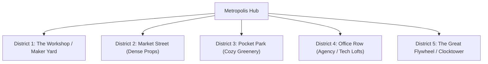

# Flywheel Master Expansion Bible: The Complete World, Narrative & Campaign Blueprint

> **"Flywheel is a tiny, mischievous storybook world about a little creature that eats cities, collects their stories, and accidentally discovers how to get the world moving again."**  
>  
> **Core Motto:** *TAKE IT IN. KEEP IT SAFE. GET IT MOVING.*

---

## 1. Executive Summary & Creative North Star

Flywheel transforms the classic "eat-and-grow" arcade genre into a charming, emotional, and kinetic world odyssey. The player does not play as a destructive anomaly or a generic black hole—they play as **Sprocket**, a sentient, expressive titanium gear whose void core generates angular momentum.

The fundamental narrative arcs of Flywheel are:
- **Eating is preservation, not destruction.** Everything Sprocket swallows is carefully preserved as a tiny miniature model inside Sprocket's **Pocket Workshop Diorama**.
- **The Shattered Marketing Engine.** The legendary, frictionless **Universal Marketing Flywheel** was dismantled by corporate silos, agency bureaucracy, and fragmented funnels, with its 29 vital mechanical components scattered inside high-security buildings across 29 global metropolises.
- **Growth restores kinetic motion.** By consuming urban matter, collapsing the "Where's Waldo" target buildings, and recovering each lost component, Sprocket builds toward the Grand Finale at Cambridge, MA to **"Swallow the Sprocket"** atop HubSpot Global HQ during the UNBOUND Summit!

---

## 2. Character Anatomy & Expression: Sprocket

Sprocket is an expressive, endearing desk-toy character.

```
                  ┌───────────────────────┐
                  │   OUTER TOOTHED RIM   │ ➔ 12 titanium-alloy gear teeth
                  │                       │   (Milling architectural matter)
                  │   ┌───────────────┐   │
                  │   │  (•)     (•)  │   │ ➔ Two animated mechanical rim eyes
                  │   │               │   │   (Curious, excited, dizzy, proud)
                  │   │   ┌───────┐   │   │
                  │   │   │ VOID  │   │   │ ➔ Frictionless gravitational singularity
                  │   │   │ CORE  │   │   │   (Stores memories & generates momentum)
                  │   │   └───────┘   │   │
                  │   └───────────────┘   │
                  └───────────────────────┘
```

### Expressive Emotional States:
1. **Idle / Resting (`• ‿ •`)**: Gentle mechanical blinks and soft rim hum.
2. **Curious (`⊙ ‿ ⊙`)**: Eyes tilt and track nearby hidden collectibles, secrets, and Momentum Friends.
3. **Excited (`★ ‿ ★`)**: Eyes widen with glee upon leveling up size tiers (unlocking cars, trees, and buildings).
4. **Dizzy / Overwhelmed (`@ ‿ @`)**: Eyes spiral comically when reaching an $8\times$ Combo Frenzy.
5. **Proud / Celebratory (`^ ‿ ^`)**: Confetti pop and rapid 360° gear-spin on sector clearance.

---

## 3. The Master Marketing Machine Board ("Reverse Operation")

Between campaign runs, the player inspects the **Master Assembly Blueprint**—a giant mechanical schematic where collected parts slot into their designated sockets like a reverse game of *Operation*:

```
                              ┌─────────────────────────────────┐
                              │    1. AWARENESS & INBOUND       │
                              │ • Broadcast Transmitter (Reach) │
                              │ • Searchlight Beacon (Attention)│
                              │ • Collection Hopper (Leads)     │
                              └────────────────┬────────────────┘
                                               │
┌─────────────────────────────────┐            │            ┌─────────────────────────────────┐
│     4. ANALYTICS & REVOPS       │        ┌───┴───┐        │    2. CONVERSION & PIPELINE     │
│ • ICP Targeting Scope (Prism)   │        │SPROCKET│       │ • Qualification Sifter (Filter) │
│ • Attribution Meter (ROI Gauge) ├────────┤ CORE  ├────────┤ • Nurture Conveyor (Lead Flow)  │
│ • Budget Governor (Balance Dial)│        └───┬───┘        │ • Deal Closer Press (Contract)  │
└─────────────────────────────────┘            │            └─────────────────────────────────┘
                                               │
                              ┌────────────────┴────────────────┐
                              │    3. RETENTION & DELIGHT       │
                              │ • Friction-Reducer Buffer (UX)  │
                              │ • Customer Delight Dynamo (Joy) │
                              │ • Referral Feedback Loop (Viral)│
                              └─────────────────────────────────┘
```

### The 4 Quadrant Completion Perks:
1. **Awareness & Inbound (Acts I & II) → Inbound Magnetism:** +15% automatic magnetic suction radius.
2. **Conversion & Pipeline (Acts III & IV) → Pipeline Velocity:** -10% mass threshold required for size tier level-ups.
3. **Retention & Delight (Acts V & VI) → Low-Churn Buffer:** Extends combo timer window to 2.5s (sustaining $8\times$ multipliers).
4. **Analytics & RevOps (Acts VI & VII) → High-Yield Attribution:** +25% bonus coin payouts across all cities.
5. **Cambridge Central Hub → Perpetual Motion:** Golden master overdrive trail and instant terminal momentum.

---

## 4. The In-Level Extraction Loop & Speedrun Rules

1. **"Where's Waldo" Target Buildings:**
   - Every city has one subtly distinct target building housing that metropolis's module.
   - Contrast scales from obvious in Act I (bright 2-story diner in a skyscraper canyon) to subtle in Act VII (unique stepped terraces, offset helipads, or unlit vintage clockfaces).
2. **Carmen Sandiego Briefing Intel:**
   - Pre-flight dossiers give clues that evolve from plain English to cryptic corporate memos and local architectural riddles.
3. **The Sub-60s Speedrun Bonus:**
   - Swallowing the module within the first 60 seconds arms a **$2\times$ Coin & Score Payout Multiplier** upon level completion.
4. **The 100% Full-Clear Gate (Option B):**
   - The module is officially banked into the master machine only upon achieving a **100% full clear** within the 5-minute clock.
5. **Replay Farming:**
   - On replays of already-cleared cities, repeating the Sub-60s extraction continues to award the $2\times$ coin payout bonus.

---

## 5. The 5 Universal City Districts

Every metropolis in the 29-city campaign is structured around five rich, interconnected districts that balance urban scale with cozy storybook personality:



1. **District 1: The Workshop / Proving Ground (Size 1 Start)**:
   - Sprocket's local staging area with workbenches, fallen nuts/bolts, blueprint shelves, and empty perches for rescued companions.
2. **District 2: Market Street (Size 1–2 Small-Object Paradise)**:
   - Dense sidewalk arrays of bakeries, fruit crates, flower boxes, cafe tables, striped awnings, and delivery vans. Designed for rapid combo chaining.
3. **District 3: Pocket Park (Size 3–4 Cozy Secret Garden)**:
   - Calm green spaces with duck ponds, willow trees, park benches, and hidden **Momentum Friends** waiting to be rescued.
4. **District 4: Office Row & Agency Lofts (Size 5–6 Tech District)**:
   - Sleek glass towers, corporate suites, and agency lofts housing the hidden **Where's Waldo** target structures.
5. **District 5: The Great Flywheel / Historic Clocktower (Size 7+ Apex Landmark)**:
   - The structural and kinetic anchor of the city. Demolishing its foundations triggers the **Kinetic Revival Wave**, restarting the city's clocks, chime bells, and transit systems!

---

## 6. Master Campaign Roster: 29 Metropolises across 7 Acts

```
[PROLOGUE & ACT I: Pacific Awakening]
  Level 0: The Workshop (Prologue) ➔ Level 1: Sydney ➔ Level 2: Auckland ➔ Level 3: Singapore
                         │
                         ▼
[ACT II: Asian Megacities & High-Density Grids]
  Level 4: Hong Kong ➔ Level 5: Seoul ➔ Level 6: Tokyo ➔ Level 7: Beijing ➔ Level 8: Bangkok ➔ Level 9: Mumbai
                         │
                         ▼
[ACT III: Desert Horizons & Mediterranean Antiquity]
  Level 10: Dubai ➔ Level 11: Cairo (Giza) ➔ Level 12: Athens ➔ Level 13: Rome
                         │
                         ▼
[ACT IV: European Capitals of Grandeur]
  Level 14: Paris ➔ Level 15: London ➔ Level 16: Amsterdam ➔ Level 17: Berlin
                         │
                         ▼
[ACT V: The Americas & Transcontinental Transit]
  Level 18: Rio de Janeiro ➔ Level 19: Buenos Aires ➔ Level 20: Mexico City ➔ Level 21: San Francisco ➔ Level 22: Chicago Loop ➔ Level 23: Toronto
                         │
                         ▼
[ACT VI: The New York Megacity Trilogy]
  Level 24: Lower Manhattan ➔ Level 25: Brooklyn ➔ Level 26: Upper Manhattan / Central Park
                         │
                         ▼
[ACT VII: The Massachusetts Tech Corridor & Grand Finale]
  Level 27: Boston Seaport ➔ Level 28: Cambridge (HubSpot Global HQ · "SWALLOW THE SPROCKET!")
```

### Complete 29-City Master Specification Table:

| Act | # | Scene ID | City & Metro | Scale (Voxels) | Landmark Heroes & Relics | Rescued Momentum Friend | Marketing Module Component |
| :--- |:---:|---|---|:---:|---|---|---|
| **Prologue** | **0** | `gallery` | **The Lab (Awakening)** | 15,767 | Crash Ramps, Calibration Pylons, Subway Terminal | *Clockwork Moth* 🦋 | **The Frictionless Drive Hub** |
| **Act I** | **1** | `sydney` | **Sydney Harbour** (Australia) | 14,120 | Opera House Sail Vaults, Harbour Bridge Arch, Circular Quay | *Sydney Seagull Bot* 🕊️ | **Oceanic Inbound Hopper** |
| | **2** | `auckland` | **Auckland** (New Zealand) | 16,000 | Sky Tower Spire, Waitematā Ferry Wharves, Mt Eden Cones | *Kiwi Clockwork Bot* 🥝 | **Pacific Signal Array** |
| | **3** | `singapore` | **Singapore Marina Bay** | 22,000 | Marina Bay Sands SkyPark, Supertrees, Merlion Statue | *Merlion Cub Bot* 🦁 | **Equatorial Broadcast Antenna** |
| **Act II** | **4** | `hongkong` | **Hong Kong** (Victoria Harbour) | 28,000 | Bank of China Tower, Peak Tram, Star Ferry | *Junk Boat Bot* ⛵ | **High-Density Feed Runner** |
| | **5** | `seoul` | **Seoul** (South Korea) | 32,000 | N Seoul Tower, Han River Bridges, Gyeongbokgung Gate | *Magpie Drone Bot* 🐦 | **High-Speed Searchlight Lens** |
| | **6** | `tokyo` | **Tokyo Shibuya & Shinjuku** | 84,122 | Shibuya Scramble, Tokyo Tower, Shinjuku Neon Canyons | *Tanuki Gear Bot* 🦝 | **Attention Escapement Core** |
| | **7** | `beijing` | **Beijing** (China) | 38,000 | Bird's Nest Lattice, CCTV Loop Tower, Forbidden Gates | *Imperial Lion Bot* 🐲 | **Organic Reach Megaphone** |
| | **8** | `bangkok` | **Bangkok** (Thailand) | 30,000 | Wat Arun Spire, Chao Phraya Barges, Tuk-Tuk Markets | *Tuk-Tuk Bot* 🛺 | **Viral Cadence Regulator** |
| | **9** | `mumbai` | **Mumbai** (India) | 34,000 | Gateway of India, Marine Drive Coastline, Victoria Terminus | *Chai Kettle Bot* 🫖 | **Cross-Channel Lead Intake** |
| **Act III** | **10** | `dubai` | **Dubai** (UAE) | 36,000 | Burj Khalifa Pinnacle, Palm Monorail, Sail Hotel | *Falcon Sky Bot* 🦅 | **High-Ticket Conversion Piston** |
| | **11** | `cairo` | **Cairo & Giza** (Egypt) | 32,000 | Giza Limestone Pyramids, Nile Felucca Docks, Sphinx | *Scarab Gear Bot* 🪲 | **Monolithic Qualification Sifter**|
| | **12** | `athens` | **Athens** (Greece) | 26,000 | Acropolis Parthenon, Plaka Stairs, Olive Groves | *Owl of Athena Bot* 🦉 | **Pricing Elasticity Differential**|
| | **13** | `rome` | **Rome** (Italy) | 35,000 | Colosseum Oval, St. Peter's Dome, Trevi Fountains | *Vespa Scooter Bot* 🛵 | **Enterprise Pipeline Valve** |
| **Act IV** | **14** | `paris` | **Paris** (France) | 42,000 | Eiffel Tower Lattice, Arc de Triomphe, Seine Bridges | *Croissant Bot* 🥐 | **Brand Polish Buffer** |
| | **15** | `london` | **London** (United Kingdom) | 45,000 | Big Ben Clock Tower, Tower Bridge, London Eye | *Double-Decker Bus Bot* 🚌 | **The Deal Closer Stamping Press**|
| | **16** | `amsterdam` | **Amsterdam** (Netherlands) | 28,000 | Canal Ring Bridges, Gable Townhouses, Windmills | *Windmill Gear Bot* 🚲 | **Frictionless Nurture Conveyor** |
| | **17** | `berlin` | **Berlin** (Germany) | 36,000 | Brandenburg Gate, Fernsehturm TV Sphere, Reichstag Dome | *Berlin Bear Bot* 🐻 | **Precision SLA Clockwork** |
| **Act V** | **18** | `rio` | **Rio de Janeiro** (Brazil) | 38,000 | Sugarloaf Cable Cars, Christ Redeemer Peak, Copacabana | *Toucan Bot* 🦜 | **Carnival Delight Dynamo** |
| | **19** | `buenosaires`| **Buenos Aires** (Argentina) | 34,000 | Avenida 9 de Julio, Obelisco Plaza, La Boca Zinc Mansions | *Bandoneón Tango Bot* 🪗 | **Advocacy Rhythm Compensator** |
| | **20** | `mexicocity` | **Mexico City** (Mexico) | 36,000 | Angel of Independence, Zócalo Cathedral, Reforma Towers | *Axolotl Gear Bot* 🦎 | **Customer Onboarding Dampener** |
| | **21** | `sanfrancisco`| **San Francisco** (California) | 44,000 | Golden Gate Bridge, Cable Cars, Transamerica Pyramid | *Cable Car Bell Bot* 🌁 | **Product-Led Growth Turbo** |
| | **22** | `chicago` | **Chicago Loop** (Illinois) | 44,578 | Willis Tower, Elevated 'L' Runaway Trains, River Bridges | *Loop Train Bot* 🚂 | **Referral Feedback Loop** |
| | **23** | `toronto` | **Toronto** (Canada) | 40,000 | CN Tower Pod, Rogers Centre Dome, Red Streetcars | *Beaver Solder Bot* 🦫 | **Net-Retention Magnetic Ring** |
| **Act VI** | **24** | `manhattan` | **Lower Manhattan** (New York) | 25,875 | Wall Street Canyons, Trinity Church, Charging Bull | *Subway Rat Bot* 🐀 | **Multi-Touch Attribution Meter** |
| | **25** | `brooklyn` | **Brooklyn** (New York) | 39,984 | DUMBO Warehouses, East River Piers, Coney Coasters | *Waterfront Crane Bot* 🏗️ | **ICP Targeting Scope** |
| | **26** | `upper-manhattan`| **Upper Manhattan** (New York) | 73,393 | Central Park Perimeter, Grand Museums, Brownstones | *Central Park Squirrel Bot* 🐿️ | **Real-Time ROI Governor Dial** |
| **Act VII** | **27** | `boston` | **Boston Seaport** (Massachusetts) | 82,894 | BCEC Convention Hall, Barking Crab, Tea Party Ships | *Beacon Hill Pigeon Bot* 🕊️ | **Omnichannel Staging Manifold** |
| | **28** | `cambridge` | **Cambridge (HubSpot HQ)** | 72,943 | 2 Canal Park, Kendall Square, The Great Sprocket Roof | *The Grand Flywheel Bot* ⚙️ | **The UNBOUND Prime Ignition Key**|

---

## 7. Core Game Mechanics & In-Universe Lore Translation

| Gameplay Mechanic | In-Universe Physical Principle | Emotional Meaning to Player |
| :--- | :--- | :--- |
| **Size Tier Ladder ($T_1 \to T_7$)** | **Rotational Inertia Law ($L = I\omega$)**: Core must mill small mass first to build rim speed before overcoming multi-ton building binding energy. | Satisfying feeling of gradual growth from tiny props to swallowing skyscrapers. |
| **Combo Multipliers ($1\times \to 8\times$)** | **Frictionless Momentum Retention**: Eating matter in rapid cadence ($<1.5\text{s}$) prevents thermal decay. | High-energy arcade flow and rhythm reward. |
| **2m Structural Crumble** | **Resonance Shear**: Undermining foundation pillars detaches modular 2m blocks into edible snacks. | Tactile joy of toppling giant towers. |
| **Pocket Workshop Diorama** | **Memory Preservation**: Swallowed hero relics are digitized and stored as collectible miniature toy models. | Completionist joy—every swallowed landmark is kept forever. |
| **Marketing Module Tokens** | **Machine Assembly**: 29 lost mechanical organs recovered and socketed into the Master Machine Board. | Rich meta-progression and strategic gameplay perks. |
| **Sub-60s Early Extraction** | **Tactical Speedrun**: Finding and collapsing the target building in under 60 seconds doubles final level payout. | High-stakes routing tension and replayability. |
| **Momentum Friends** | **Kinetic Companions**: Mechanical animal friends rescued from frozen cities that live on Sprocket's Workshop perches. | Warmth, friendship, and character charm. |
| **Kinetic Revival** | **The Flywheel Effect**: 100% clearing re-ignites kinetic momentum, making trains roll, clocks tick, and lights turn on. | Deep satisfaction of leaving the world better and moving again. |

---

## 8. Mobile-First Experience & Technical Invariants

1. **Dual-Zone Touch & Pinch Zoom**:
   - Left thumb = fluid omni-directional steering.
   - Right thumb = smooth camera orbit.
   - Two-finger pinch/expand = responsive zoom in and out.
2. **Adaptive Portrait Camera FOV**:
   - Smooth aspect curve $V(\text{aspect}) = 45^\circ / \sqrt{\text{aspect}}$ locks horizontal FOV $\ge 68^\circ-72^\circ$ on mobile phones, eliminating tunnel vision.
3. **High-DPI Mobile Clarity**:
   - Razor-sharp $1.5\times$ DPR scaling with directional depth shadows and ambient lighting.
4. **Pure Sim Boundary & Determinism**:
   - Zero Three.js / DOM in sim logic (`rng.js`, `tiers.js`, `sim.js`, `voxelsim.js`).
   - 100% deterministic seeded RNG. All code validated by `tools/validate.mjs`.
5. **Offline-First & Zero Friction**:
   - Entire campaign playable offline with automatic local storage and optional cloud synchronization.
