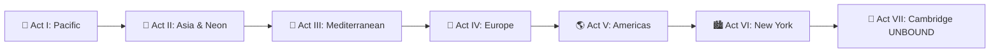

---
covers:
  - "js/citycatalog.js"
  - "js/ui/screens.js"
---
# 00 — Objective Overview: The Global Campaign & Sprocket Odyssey

## 1. Executive Summary

**Flywheel** is fundamentally "A sprocket's story." While the game's mechanics deliver addictive, physics-based voxel consumption and structural collapse, the overarching campaign gives players emotional context, geographical momentum, and an epic progression ladder.

The **Global Campaign** expands the game from a regional showcase into a worldwide odyssey of **29 canonical metropolises** across **7 regional Acts**. Starting from the subterranean calibration yards of *The Lab*, Sprocket journeys across Oceania, Asia, the Mediterranean, Europe, and the Americas, culminating at **HubSpot Global Headquarters in Cambridge, MA** for the climactic **UNBOUND Summit**.

---

## 2. Core Pillars

1. **Narrative Grounding for Core Mechanics**: Every game mechanic (the $T_1 \to T_7$ tier ladder, $8.0\times$ combo multiplier, 2m bay crumble physics, power-up orbital drops, and 5-minute clearing limits) is explained through the in-universe physics of **rotational angular momentum** and the **Flywheel Effect**.
2. **True Global Representation**: Players tour the most famous capitals and landmark-rich skylines on Earth, experiencing distinct architectural idioms (Gothic vaults in Sydney, Haussmann boulevards in Paris, elevated rail loops in Chicago, ancient Parthenon colonnades in Athens, and hyper-dense neon grids in Tokyo).
3. **Graceful Shipped vs. In-Development Parity**: The master catalog natively supports both **active playable sandboxes** (with full voxel meshes, collision grids, and greedy-bot validation) and **upcoming tour destinations** (with complete mission dossiers, architectural blueprints, and locked campaign gates).
4. **The Ultimate Payoff at UNBOUND**: The entire global journey builds momentum toward Cambridge, MA. Swallowing the famous Sprocket mark atop 2 Canal Park / First Street Garage achieves infinite flywheel velocity, closing the protagonist's narrative loop.

---

## 3. High-Level Architecture

| Layer | Responsibility | Key Module |
|---|---|---|
| **Data & Progression** | Authoritative 29-city metadata, Act definitions, unlock gates, and coin economies. | `js/citycatalog.js` |
| **Narrative & UI** | Act-based carousel navigation, mission dossiers, story transmissions, and Ready Gate directives. | `js/ui/screens.js`, `js/ui/ready.js` |
| **Simulation & Voxel Scenes** | Pure simulation boundary, anisotropic voxel grids, and structural collapse. | `js/voxelsim.js`, `js/voxelscene-*.js` |
| **Validation & Test Harness** | Headless automated verification ensuring 0 cell overlaps, 100% stability, and deterministic margins. | `tools/validate.mjs`, `tools/validate-sydney.mjs` |
