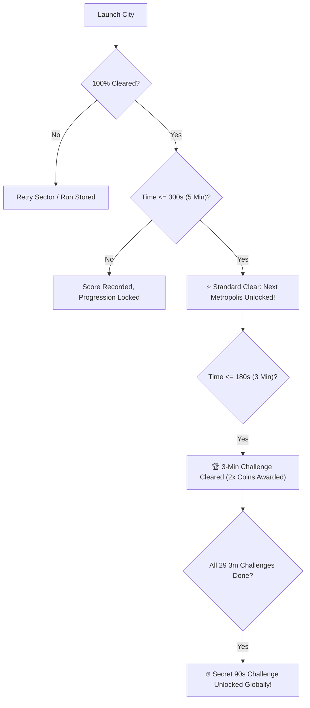

---
covers:
  - "js/citycatalog.js"
  - "js/ui/screens.js"
  - "js/save.js"
---
# 03 — Mechanics & Progression Architecture

## 1. Progression Gate Architecture

Progression across the 29-metropolis campaign follows strict, deterministic rules designed to reward mastery while maintaining accessibility:



### Key Progression Rules:
1. **Starter Unlocks**: *The Lab* (Prologue) and *Sydney Harbour* (Chapter 1) are unlocked by default on fresh saves.
2. **Next Metropolis Unlock Gate**: A subsequent metropolis unlocks when the immediately preceding playable metropolis has achieved a **100% full clear** (`completions > 0` or `bestPercent >= 1.0`) in **$\le 300\text{s}$ (5 minutes)**.
3. **Playable vs. Development Cities**: Cities flagged as `status: 'DEVELOPMENT'` display their full mission dossier, architectural previews, and target landmarks, but are marked with a `🚧 UNDER CONSTRUCTION` badge while their voxel scenes are being authored. Progression seamlessly unlocks the next *shipped* metropolis in sequence.
4. **3-Minute Speed Challenge**: Clearing a city at 100% within 180s permanently awards the **3-Minute Challenge Star** and doubles all earned coins.
5. **Secret 90-Second Apex Mode**: Completing all 3-minute city challenges unlocks the legendary **Secret 90s Challenge**, placing the player in hyper-dense sectors under an aggressive 90-second orbital clock.

---

## 2. City Catalog Data Schema (`js/citycatalog.js`)

To decouple UI presentation from hardcoded values, `CITY_CATALOG` serves as the single source of truth:

```javascript
export const CITY_CATALOG = [
  {
    scene: 'sydney',
    name: 'SYDNEY HARBOUR',
    location: 'SYDNEY, AUSTRALIA',
    act: 'ACT I',
    actTitle: 'THE PACIFIC AWAKENING',
    sub: 'Opera House, Harbour Bridge & Circular Quay',
    desc: 'Sprocket goes global. Soaring ceramic sail vaults, deep water bays, and the iconic Coathanger bridge.',
    tagline: 'CHAPTER 1 · HARBOUR VOYAGE',
    chapter: 'CHAPTER 1',
    status: 'PLAYABLE', // 'PLAYABLE' | 'DEVELOPMENT'
    blocks: 14120,
    difficulty: 'TIER 2 · CASUAL',
    badge: 'ACT 1',
    accentColor: '#4cc9f0',
    icon: '🦘',
    coinCount: 70,
    coinValue: 1,
    goalBonus: 50,
    heroes: ['Opera House Sail Vaults', 'Harbour Bridge Arch', 'Sydney Tower Eye'],
    directive: 'CALIBRATE OCEANIC INERTIA & CONSUME THE SAIL VAULTS',
    transmission: 'Target: Port Jackson. Ingest coastal bollards and ferries to build sufficient angular velocity for the Harbour Bridge through-arch.',
    debrief: 'Sydney sector 100% converted. Oceanic resonance achieved. Vector locked for trans-Pacific leap.',
  },
  // ... (All 29 Metropolises)
];
```

---

## 3. UI Presentation & Act Grouping Contract

The City Selection interface (`js/ui/screens.js`) provides:
1. **Act Navigation Filter**: Filter carousel view by Act (Act I through VII) or browse in continuous global progression order.
2. **Interactive Mission Dossier Drawer**: Expands to reveal Sprocket's tactical transmission, target hero landmarks, and narrative debrief upon 100% completion.
3. **Dynamic Status Badging**: Clear visual distinction between `✦ OPEN ✦`, `🏆 100% CLEARED`, `⭐ 3-MIN CLEARED`, `🔒 LOCKED`, and `🚧 COMING SOON`.
