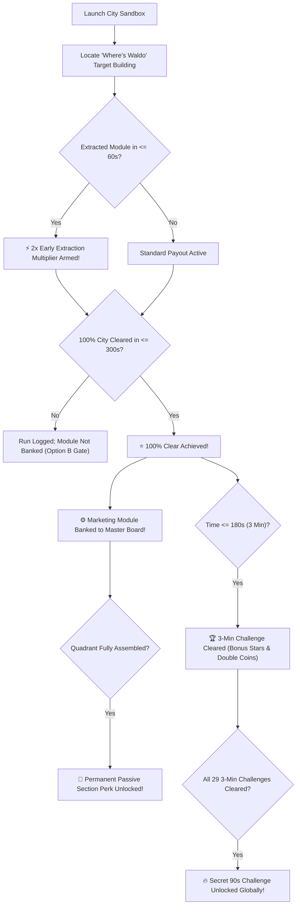

---
covers:
  - "js/citycatalog.js"
  - "js/ui/screens.js"
  - "js/save.js"
  - "js/voxelsim.js"
  - "js/tiers.js"
  - "js/sim.js"
---
# 03 — Mechanics & Progression Architecture: The Marketing Machine & Campaign Loop

## 1. Progression Gate & Replay Architecture

Progression across the 29-metropolis campaign follows strict, deterministic rules designed to reward mastery, observation, and speed:



---

## 2. Core Campaign Mechanics Specifications

### A. The Marketing Engine Module Tokens
* **In-World Presentation:** Heavy, machined industrial cartridges floating 1.2m above ground with a glowing vertical cyan/gold particle column and a low-frequency hum.
* **Extraction:** Hidden inside the city's unique "Where's Waldo" target structure. When the player chews through load-bearing corners and collapses the building, the module ejects and lands on the ground.
* **Collection Event:** Swallowing the module triggers:
  1. Particle burst & screen flash.
  2. Anime milestone banner: `PART RECOVERED: [MODULE NAME]`.
  3. Audio event: `module_extracted` (mechanical ratcheting stinger).
* **The 100% Full-Clear Gate (Option B):** The module is officially banked into the player's permanent save file **only upon achieving a 100% full clear** within the 300s sector limit. If the player quits or fails to reach 100%, the module is not banked.

### B. Sub-60s Speedrun Early Extraction Bonus
* **HUD Indicator:** A golden countdown timer displayed in the upper right (`EXTRACTION: 0:59...`).
* **Multiplier:** Swallowing the module at $t \le 60\text{s}$ sets `sim.speedrunBonusArmed = true` and triggers a golden HUD badge: `⚡ 2X BONUS ARMED!`.
* **Payout Calculation:** On 100% level completion, if `speedrunBonusArmed === true`, total coins collected, goal completion bonuses, and final score are **multiplied by $2.0\times$**.
* **Replay Farming:** On subsequent runs of cleared cities, the module socket remains filled on the blueprint, but repeating the Sub-60s extraction continues to award the $2\times$ payout.

---

## 3. Save Schema v26 Specification (`js/save.js`)

To persist module collection, quadrant completion, and speedrun records, save schema version increments **v25 → v26** (ADR-0023).

```javascript
// In js/save.js
export const CURRENT_VERSION = 26;

export function freshSave() {
  return {
    version: 26,
    // ... existing fields ...
    // Storyline & Marketing Engine State:
    campaignModules: [],       // Array of collected module IDs: ['mod_prologue_spindle', 'mod_sydney_hopper', ...]
    quadrantsUnlocked: [],     // Array of completed quadrant IDs: ['AWARENESS', 'CONVERSION', ...]
    speedrunExtractions: [],   // Array of city scenes where sub-60s extraction was accomplished: ['sydney', 'tokyo', ...]
  };
}

// Migration v25 -> v26
__MIGRATIONS[25] = (old) => {
  return {
    ...old,
    version: 26,
    campaignModules: Array.isArray(old.campaignModules) ? old.campaignModules : [],
    quadrantsUnlocked: Array.isArray(old.quadrantsUnlocked) ? old.quadrantsUnlocked : [],
    speedrunExtractions: Array.isArray(old.speedrunExtractions) ? old.speedrunExtractions : [],
  };
};
```

---

## 4. Passive Quadrant Perks: Mathematical Specifications & Sim Hooks

Assembling all modules within a quadrant permanently unlocks a passive gameplay modifier across all sandboxes and campaign levels:

| Quadrant | Required Modules | Passive Perk | Effect | Code Hook |
|---|---|---|---|---|
| **Quadrant 1: Awareness** | 7 Modules (Acts I–II) | **Inbound Magnetism** | **+15% Magnetic Pull Radius** for props, debris, and coins. | `js/voxelsim.js` suction radius: `baseRadius * (hasQuadrant('AWARENESS') ? 1.15 : 1.0)` |
| **Quadrant 2: Conversion** | 7 Modules (Acts II–IV) | **Pipeline Velocity** | **-10% Mass Threshold** needed to advance size tiers. | `js/tiers.js` mass calculation: `requiredMass * (hasQuadrant('CONVERSION') ? 0.90 : 1.0)` |
| **Quadrant 3: Retention** | 9 Modules (Acts IV–V) | **Low-Churn Buffer** | **+1.0s Combo Grace Window** (extends decay timer from 1.5s to 2.5s). | `js/voxelsim.js` combo timer: `baseGrace * (hasQuadrant('RETENTION') ? 1.67 : 1.0)` |
| **Quadrant 4: Analytics** | 5 Modules (Acts VI–VII) | **High-Yield Attribution** | **+25% Coin Payout & Base Value** across all runs. | `js/voxelsim.js` / `js/main.js` coin payout calculations. |
| **Center Hub: UNBOUND Core** | Cambridge Module | **Perpetual Motion** | Golden overdrive cosmetic particle trail and instant terminal velocity. | `js/voxelworld.js` Sprocket rim particle shader. |

---

## 5. UI Presentation Contract: The Master Blueprint Screen

### Wireframe & Layout Contract (`showMachineBlueprint` / `js/ui/screens.js`)

```
┌────────────────────────────────────────────────────────────────────────────┐
│ ⚙️ THE SPROCKET WORKSHOP · MASTER MARKETING ENGINE            [✖ CLOSE]    │
│ "TAKE IT IN. KEEP IT SAFE. GET IT MOVING."                                 │
├────────────────────────────────────────────────────────────────────────────┤
│                                                                            │
│                     ┌───────────────────────────────┐                      │
│                     │     QUADRANT 1: AWARENESS     │                      │
│                     │     [ 4 / 7 MODULES ]         │                      │
│                     │  [🦘][⛵][🦁][🚢][·][·][·]    │                      │
│                     │  PERK: +15% Inbound Suction   │                      │
│                     └───────────────┬───────────────┘                      │
│                                     │                                      │
│  ┌─────────────────────────────┐    │    ┌──────────────────────────────┐  │
│  │   QUADRANT 4: ANALYTICS     │    │    │    QUADRANT 2: CONVERSION    │  │
│  │   [ 2 / 5 MODULES ]         ├───(⚙️)──┤    [ 1 / 7 MODULES ]         │  │
│  │   [🍁][🏙️][·][·][·]         │ SPROCKET│    [🐉][·][·][·][·][·][·]    │  │
│  │   PERK: +25% Coin Yield     │  CORE   │    PERK: -10% Tier Mass Req  │  │
│  └─────────────────────────────┘    │    └──────────────────────────────┘  │
│                                     │                                      │
│                     ┌───────────────┴───────────────┐                      │
│                     │     QUADRANT 3: RETENTION     │                      │
│                     │     [ 3 / 9 MODULES ]         │                      │
│                     │  [🥐][·][·][·][🌴][·][·][·][🚂]│                      │
│                     │  PERK: +1.0s Combo Grace      │                      │
│                     └───────────────────────────────┘                      │
│                                                                            │
├────────────────────────────────────────────────────────────────────────────┤
│ 🕊️ RESCUED MOMENTUM FRIENDS (11 / 29)                                      │
│ [🦋 Moth] [🕊️ Seagull] [🥝 Kiwi] [🦁 Merlion] [🦝 Tanuki] [🚂 Loop Train]...│
└────────────────────────────────────────────────────────────────────────────┘
```

### Module Slot Visual States:
1. **LOCKED (`.mod-slot.locked`):** Dark grey recessed socket with faint dashed outline. Displays city icon and name. Tapping reveals city mission dossier and intel clue.
2. **RECOVERED (`.mod-slot.recovered`):** Glowing cyan/gold metallic badge with spinning gear icon. Hovering/tapping displays module name, mechanical function, and lore.
3. **SPEEDRUN BADGE (`.speedrun-badge`):** A small golden lightning bolt (`⚡`) on the corner of the module slot if extracted in $\le 60\text{s}$.
