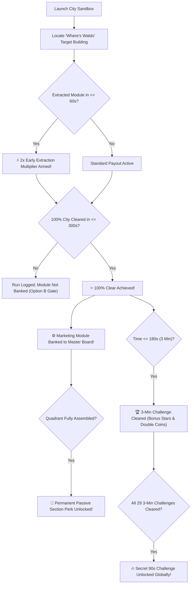

---
covers:
  - "js/citycatalog.js"
  - "js/ui/screens.js"
  - "js/save.js"
---
# 03 — Mechanics & Progression Architecture: The Marketing Machine & Campaign Loop

## 1. Progression Gate & Replay Architecture

Progression across the 29-metropolis campaign follows strict, deterministic rules designed to reward mastery, observation, and speed:



---

## 2. Core Campaign Mechanics Specifications

### A. The Marketing Engine Module Tokens
* **In-World Presentation:** Heavy, machined industrial cartridges floating 1m above ground with a glowing vertical golden/cyan kinetic beam and an audible low-frequency mechanical hum.
* **Extraction:** Hidden inside the city's unique "Where's Waldo" target building. As the player reaches Size 4–5 and breaks load-bearing corner bays, the building collapses and ejects the module.
* **Collection Event:** Swallowing the module triggers an anime milestone banner (`PART RECOVERED: [MODULE NAME]`) with custom mechanical ratcheting audio.
* **The 100% Full-Clear Gate (Option B):** The module is only permanently banked into the player's save file upon achieving a **100% full clear** within the standard 300s (5-minute) sector limit.

### B. Sub-60s Speedrun Early Extraction Bonus
* **HUD Indicator:** A golden 60-second timer counts down from 1:00 at level start (`EARLY EXTRACTION WINDOW: 0:59...`).
* **Multiplier:** Swallowing the module before $t=60\text{s}$ arms a **$2\times$ Multiplier** on the final level coin and score payout upon 100% completion.
* **Replay Farming:** On subsequent runs of already-cleared cities, the module slot remains filled on the blueprint, but repeating the Sub-60s extraction continues to award the $2\times$ payout.

### C. The 4 Quadrant Completion Perks
Assembling all modules in a quadrant permanently activates a passive perk in the player's profile:

1. **Top Quadrant: Inbound & Awareness (Acts I & II)**
   * *Perk:* **Inbound Magnetism** — Expands the automatic suction radius for coins and Tier 1 props by 15%.
2. **Right Quadrant: Conversion & Pipeline (Acts III & IV)**
   * *Perk:* **Pipeline Velocity** — Reduces the total mass needed to advance to the next size tier by 10%.
3. **Bottom Quadrant: Retention & Delight (Acts V & VI)**
   * *Perk:* **Low-Churn Buffer** — Extends the combo meter decay grace window from 1.5s to 2.5s, allowing effortless maintenance of $8\times$ multipliers.
4. **Left Quadrant: Analytics & RevOps (Acts VI & VII)**
   * *Perk:* **High-Yield Attribution** — Increases base coin value and full-clear payout bonuses across all cities by 25%.
5. **Center Core: UNBOUND Master Hub (Cambridge Finale)**
   * *Perk:* **Perpetual Motion** — Golden cosmetic overdrive trail and instant maximum momentum retention.

---

## 3. The "Where's Waldo" & Carmen Sandiego Intel Progression

### Visual Differentiation Hierarchy:
* **Acts I–II (Obvious Contrast):** 2-story brick bookstore or diner placed directly adjacent to uniform 30-story towers; vivid saturated paint colors.
* **Acts III–IV (Architectural Flourish):** Unique rooflines, historic copper domes, or stone porticos standing out against modern glass curtain walls.
* **Acts V–VII (Subtle Geometry):** Off-axis footprint angles, non-standard fire escapes, unique water towers, or unlit vintage clockfaces.

### Pre-Flight Briefing Clue Evolution:
* **Act I (Plain English):** *"Intel: Target module is stored in the 2-story red diner on the waterfront wharf."*
* **Acts II–IV (Telegraphic Memos):** *"Intercepted cable: Component relocated to agency loft with emerald copper roof overlooking the canal loop."*
* **Acts V–VII (Local Lore Riddles):** *"Follow where the elevated rail tracks bend south past the only pre-war brick facade with an unlit clockface."*

---

## 4. Master Data Schema Extension (`js/citycatalog.js`)

Each city's entry in `CITY_CATALOG` incorporates the marketing module metadata and Carmen Sandiego clue:

```javascript
{
  scene: 'sydney',
  name: 'SYDNEY HARBOUR',
  location: 'SYDNEY, AUSTRALIA',
  act: 'ACT I',
  actTitle: 'THE PACIFIC AWAKENING',
  sub: 'Opera House, Harbour Bridge & Circular Quay',
  // ... standard fields ...
  moduleToken: {
    id: 'inbound_hopper_sydney',
    name: 'OCEANIC INBOUND HOPPER',
    quadrant: 'AWARENESS', // 'AWARENESS' | 'CONVERSION' | 'RETENTION' | 'ANALYTICS' | 'CORE'
    desc: 'Catches incoming maritime signals and converts coastal waves into inbound momentum.',
    targetBuilding: 'Red-Roofed Wharf Warehouse',
    intelClue: 'Intel: Target module is stored inside the red-roofed wharf warehouse on the eastern quay.',
    difficulty: 'OBVIOUS_CONTRAST',
  },
}
```

---

## 5. UI Presentation Contract: The Master Blueprint Screen

1. **The Machine Blueprint Workbench (`showMachineBlueprint`):**
   * An interactive schematic displaying the 4 quadrants and central Sprocket hub.
   * Unlocked modules gleam with animated spinning gears and golden power traces.
   * Empty sockets pulse with faint wireframes and display the gating city name and module description.
2. **HUD In-Game Overlays:**
   * Golden 60s countdown timer at level start.
   * `⚡ 2X BONUS ARMED!` badge upon sub-60s module extraction.
   * Full-screen celebration banner and audio stinger upon module swallow.
3. **Victory Debrief:**
   * Shows banked module, quadrant assembly progress, and applied perk bonuses.
