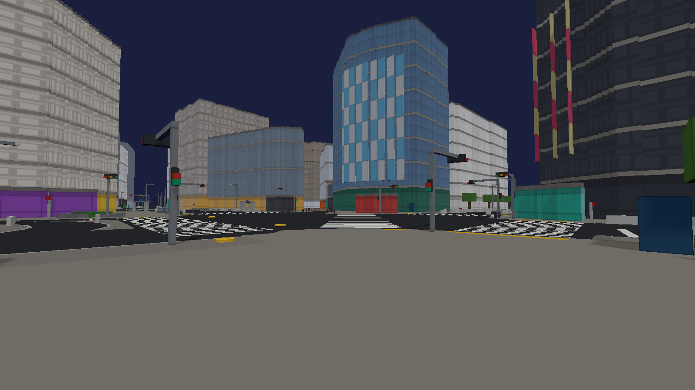
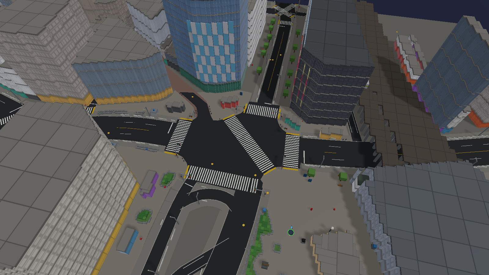
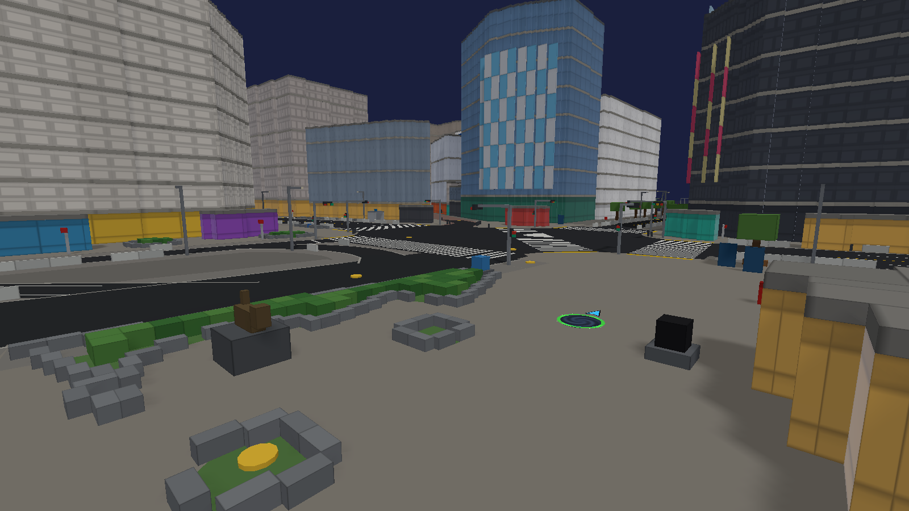
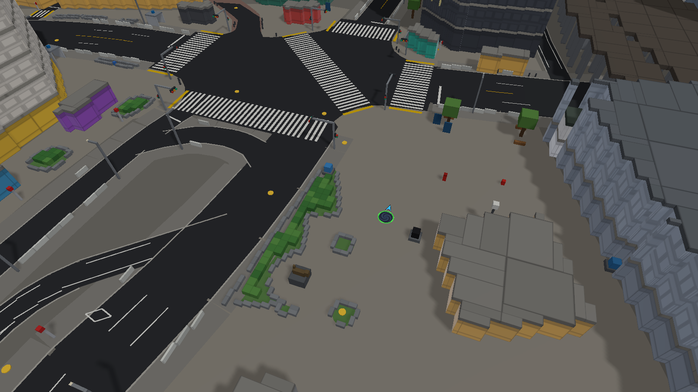
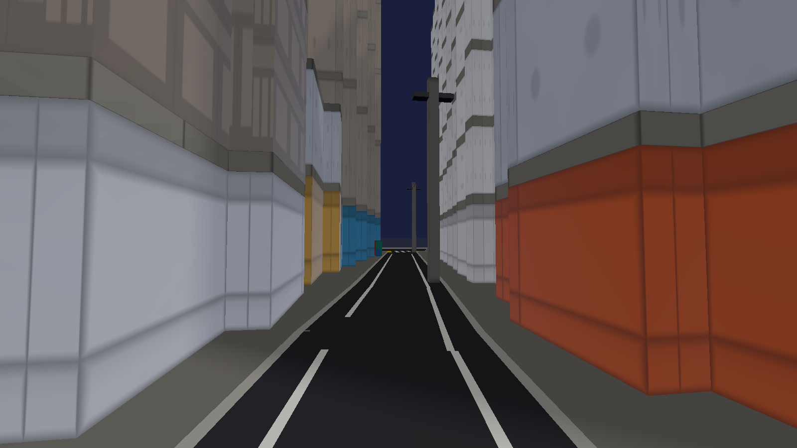
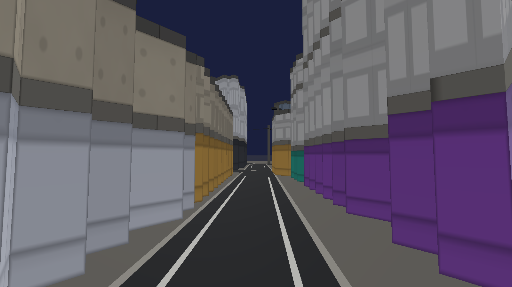
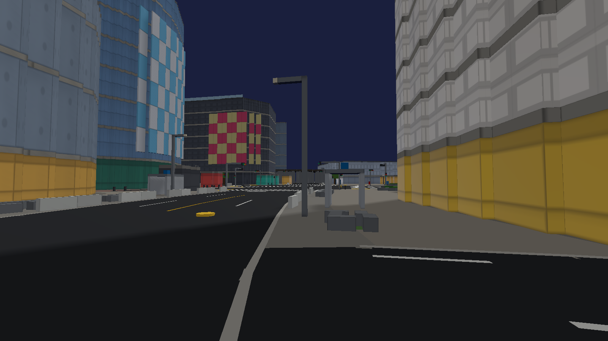
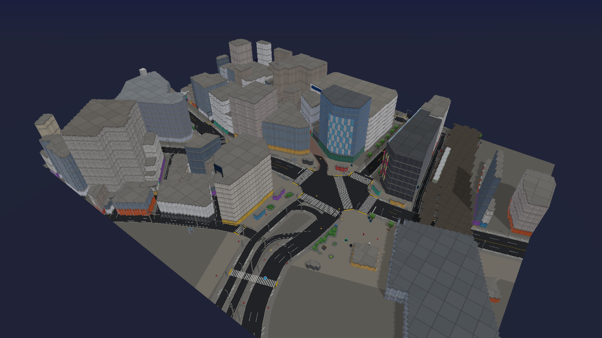

# The Lab: Tokyo remake, phase 1 (Shibuya Crossing)

Shipped 2026-09-27. The Lab is now Shibuya Crossing, rebuilt from real map
data. Every building sits on its real footprint at its real height. Every
crossing, stop line and signal pole is where the street needs one. This is
also the template for rebuilding every other city, so the method section
below is written to be reused.

## What the owner sees

| View | Screenshot |
|---|---|
| The scramble from the Hachiko corner (street level) |  |
| The scramble from above: five crossings and the one diagonal |  |
| Hachiko Square, where you start |  |
| Hachiko Square from above |  |
| A side street: painted walking strips, a utility pole |  |
| A side street with poles and overhead wires |  |
| Dogenzaka: bus shelter, lamps, guard rails, QFRONT and MAGNET ahead |  |
| The whole district |  |

- **The scramble**: five zebra crossings and the single diagonal, running from
  the Hachiko corner to the QFRONT corner. Shibuya has one diagonal, not an X;
  the OpenStreetMap survey and published descriptions agree. Stop lines sit on
  the lanes approaching the junction. A signal pole stands at every corner,
  with a pedestrian head and an arm carrying the vehicle lights over the lanes.
- **Landmarks** on their mapped footprints: QFRONT with the Q's Eye screen
  facing the crossing, MAGNET by SHIBUYA109 with its screens and rooftop deck
  rail, the Ekimae building's rooftop billboards, SHIBUYA109's sign drum at the
  Dogenzaka fork, Seibu A's blue band. You also get Hachiko on his plinth where
  the statue stands, the station koban, the JR Yamanote/Saikyo viaduct with a
  stopped Yamanote train, and the Shibuya station edge.
- **Street furniture in Japanese positions**: white guard rails along the main
  roads, broken at crossings and bus stops. Street lamps along the main roads.
  Concrete utility poles in the painted edge strip of side streets, with wires
  between them. Vending banks against shopfronts, each with its recycling box.
  Also red post boxes, hydrant signs, bus stops, the taxi rank with waiting
  taxis, bollards at plaza edges, metro entrances, trees, and planting beds with
  granite edging and azalea hedging.
- **Starting out**: you spawn on open paving in Hachiko Square. The planting
  bed around Hachiko, the statue and the small beds feed a new hole to SIZE 4
  in about 20 seconds. The validator's 68 s tour reaches SIZE 12.

## Measured, before and after

| | Before (HEAD, Nishi-Shinjuku phase 0) | Abandoned Shibuya draft (not shipped) | Now (Shibuya from OSM) |
|---|---:|---:|---:|
| Physical pieces | 2,244 | 7,474 | **22,718** (291 cubes, 22,427 architectural) |
| Buildings | 5 hand-authored | 9 hand-authored, placed by eye | **109 real footprints** + koban + viaduct |
| Occupancy grid | 0.25 m cell grid | 0.25 m cell grid | **box grid** |
| Sim build, Node | 0.13 s | 2.9-3.2 s | 0.83-0.88 s |
| Sim heap, Node | 18 MB | 250 MB | 44 MB |
| Browser: sim + renderer + first frame | 0.44-0.53 s | 3.9 s (PERF-2026-09-25) | 1.26-1.28 s |
| Browser JS heap after GC | 29 MB | n/a | 44 MB |
| Frame time at spawn (p50 / p95) | 3-4 / 10-17 ms | n/a | 4.8-5.1 / 18-20 ms |

The rig matches PERF-2026-09-25: headless Chromium, ANGLE/D3D11, 1280x800. It
ran 3 cold runs per build. Ten times the pieces of the old Lab load 3x faster
and use a fifth of the memory of the hand-placed draft. The reason is the box
grid: a wall panel costs one record, not one per quarter-metre cell. About
0.4 s of the remaining build is the adjacency pass (`_buildNeighbors`). A
range-query adjacency for the box grid is the next load win (see "Later").

## The method: rebuilding a city from real data

This is the template. Each step has a reusable part; only the last step is
city-specific.

1. **Fetch the district from OpenStreetMap.** Take a bbox of about 300 x
   250 m around the hero site from the OSM API. It is free, and the Overpass
   mirrors work too:
   `curl --ssl-no-revoke "https://api.openstreetmap.org/api/0.6/map.json?bbox=W,S,E,N" -o raw.json`.
   Keep the raw file out of the repo.
2. **Write a district config** (`tools/citydata/<city>.config.mjs`):
   - origin lat/lon;
   - a frame rotation that puts the hero buildings' street grid on the voxel
     axes, found with the per-building edge-angle histogram described in that
     file's header;
   - a shift that puts the fixed solo spawn (0, 16) on open paving next to
     starter food;
   - bounds;
   - exclusions: indoor concourse outlines and walkway decks that OSM maps as
     buildings.
3. **Extract**: `node tools/citydata/extract-osm.mjs <config> raw.json`. This
   writes `js/citydata/<city>.js`, a plain module carrying buildings
   (footprint, levels, height, min level), roads (class, lanes, one-way),
   crossing ways with their tags, plazas, planting, elevated rail, and point
   furniture. It carries OSM attribution (ODbL) in its header and `meta`.
   Never hand-edit it; re-run the extractor.
4. **Buildings: `js/footprint-shell.js`.** Each footprint is rasterised onto a
   shared 0.5 m lattice. Buildings within 4 degrees of the axes are snapped to
   clean rectangles; the rest are stair-stepped on 1 m cells. Cells are claimed
   in build order, so shells can never overlap (build landmarks first). Each
   shell gets:
   - storey-high wall panels one bay (5.5 m) wide, with a window surface;
     shopfront surface at street level;
   - floor plates on a structural grid;
   - columns only under plates no wall carries;
   - nothing inside.
   Height from OSM `height` wins; `building:levels` sets the storey rhythm.
   Background blocks carry a plate every second storey.
5. **Streets: `js/streetkit.js`.** `planStreets(data, PROFILE)` turns the data
   into flat ground decor: road polygons at real angles, kerbs, sidewalk
   bands, lane lines, zebra bars, stop lines, tactile blocks and diamonds. It
   also produces a prop plan and the life seam. `placeProps` emits the props
   as pieces. A prop is placed whole or not at all, and never overlaps a
   building, another prop or (below 3 m) the carriageway.
6. **Country profile.** `JP` is complete. `US`, `UK` and `EU` are drafts that
   state only what changes placement: which side traffic keeps to, crossing
   style, stop-line setback, post-box colour, whether vending machines and
   guard rails exist. Finishing one means filling in the rest from that
   country's marking regulations and dropping `draft`.
7. **Scene file** (`js/voxelscene-<city>.js`): import the data, build
   landmarks first with their dressing (screens, signs, rooftop features),
   then all other footprints, then the city's special structures (viaducts,
   statues), then streets. Publish `sim.lab` (or the city's equivalent) so the
   test can check placement against the data.
8. **Test first** (`tools/lab-tokyo.test.mjs` is the pattern). Coordinates in
   tests are read from the data module, never restated.

### Japan placement conventions encoded in profile `JP`

| Object | Where it goes | Source |
|---|---|---|
| Zebra crossing | Every OSM crossing with markings. 45 cm bars at 90 cm pitch, 4 m wide (6 m on the scramble) | OSM ways and nodes; 道路標示 order |
| Stop line | Approach lanes only (left half on two-way roads), at least 2 m before the bars; 45 cm on two or more lanes, 30 cm otherwise | rule |
| Diamond "crossing ahead" | 30 m and 50 m before crossings without signals | rule |
| Signal pole | Every corner of a signalled crossing: pedestrian head on the pole, vehicle head on an arm over the lanes | rule, from OSM `crossing=traffic_signals` |
| Tactile blocks | Both ends of every marked crossing, full width | rule (OSM `tactile_paving` where tagged) |
| Guard rail | Kerb of arterial roads, broken at crossings, junctions and bus stops | rule |
| Street lamp | Arterials, alternating sides about every 15 m, clear of signal poles | rule |
| Utility pole and wires | Side streets only, in the painted edge strip, about 30 m apart, wired pole to pole | rule |
| Vending bank and recycling box | Flush against shopfronts, 2-3 machines, every 45-70 m | rule (OSM nodes where mapped) |
| Public bins | Next to vending machines only (Tokyo has almost no others) | rule plus OSM |
| Post box | OSM positions, plus one at the station plaza | OSM plus rule |
| Hydrant | Underground: yellow lid and sign post. Wall type: red box | OSM `fire_hydrant:type` |
| Bus stop, taxi rank, trees, bollard line, metro entrance, clock, phone, info board | At the mapped node or way | OSM |
| Planting beds | Granite edging and azalea hedging in every mapped grass bed; trees on a 5 m grid where OSM maps none | rule |
| Bollards | Where a plaza meets a road with no guard rail, stopping at crossing mouths | rule |

Every placed prop records `src: 'osm'` or `src: 'rule'`, so a reviewer can
tell surveyed positions from convention.

## What the test enforces (`tools/lab-tokyo.test.mjs`, section `labDoctrine`)

- The district data is OSM with ODbL attribution, and the playable area is the
  data district.
- The Lab runs on the box grid (independent of the Tokyo v2 physics tune), and
  no two pieces overlap. The grid records every intersection on insert.
- Every mapped building is built. Its roof is within 1.5 m of the mapped
  height, and its storeys follow `building:levels`.
- Landmark footprints: QFRONT, MAGNET, Ekimae, 109 and Seibu A each cover at
  least 90% of their mapped footprint, with at most 8% outside it. They are
  hollow at mid-storey.
- Every marked crossing has its bars at the Japanese pitch, and every
  signalled crossing has a signal pole at each corner. The scramble paints 5+
  crossings including one diagonal.
- Every stop line sits at least 2 m before its crossing, on the left-hand
  approach.
- No furniture below 3 m stands in the carriageway; vehicles are exempt.
  Utility poles stand on side streets. Vending banks carry recycling boxes.
  Wires span pole to pole.
- The life seam exists, and lanes keep left.
- Mixed geometry. The budget is 12k-25k pieces, and the catalog card matches
  the real count. No grade piece is too large to eat. The city stands idle for
  3 s. The Hachiko starter route eats 60+ pieces and reaches SIZE 4.

## Seams for the next phases

- **Moving life** (planned separately, not built): `sim.sceneLife` (also `sim.lab.life`) records the
  following.
  - Sidewalk and footway walk paths.
  - Every crossing with its ends, width and control.
  - Every traffic lane with its travel direction (left-hand).
  - Stop lines.
  - Signalled junctions with approximate phase timings. The scramble has an
    all-way walk phase.
  - Perches: tree canopies, signal arms, guard-rail tops.
  - A pigeon flock spot at Hachiko.
- **More Tokyo districts**: Nishi-Shinjuku (the previous Lab's subject),
  Kabukicho and Meiji Jingu become further data modules in the same frame. Each
  runs the same extractor with its own bbox, and the frame origin stays shared.
- **Other cities**: finish a draft profile, then follow the method.
- **Grid migration**: `BOX_GRID_SCENES` in `js/voxelsim.js` lists the scenes on
  the box grid. Move others one at a time behind their validator section.

## Later (not done in this phase)

- **Box-grid adjacency.** A range-query adjacency for the box grid would take
  about 0.4 s off the build.
- **Station building.** It is modelled only as its clipped OSM footprint
  (3 levels). The Scramble Square tower and the Toyoko redevelopment sit
  outside the district or are construction sites in OSM.
- **Rotated props.** Guard rails and props follow the nearest axis. On roads
  at an angle to the grid they read as short stepped runs, because props are
  axis-aligned boxes.
- **Signal timing.** The timings are published approximations, marked
  `approx: true`. No survey was used.
