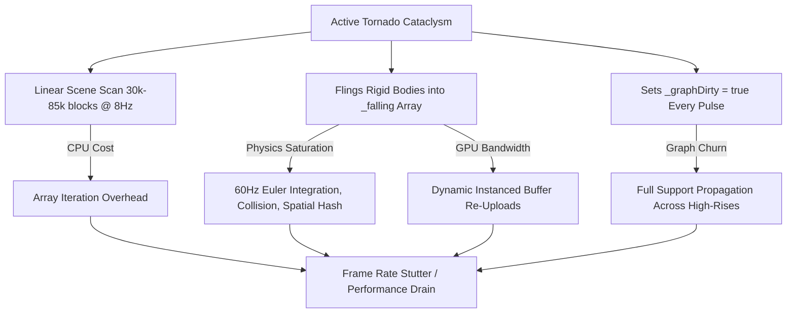
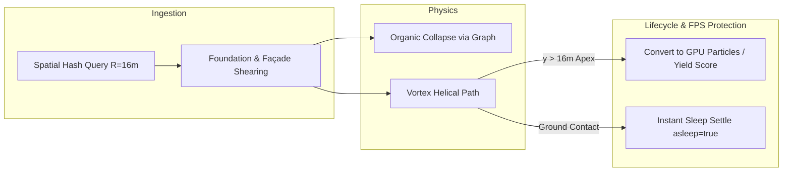

# Architecture Proposal: Tornado Cataclysm — High-Destruction & High-FPS Optimization

> **Status**: PROPOSAL / SPECIFICATION  
> **Scope**: `StormSystem` in `js/voxelsim.js`, Debris Physics in `js/voxelsim.js`, Particle & Funnel Rendering in `js/voxelworld.js`  
> **Target**: 5×–10× Destructive Impact with Locked 60 FPS (Sub-5ms Sim Step Budget)

---

## 1. Executive Summary

The dynamic **Storm System** (`tornado` and `hurricane` cataclysms) provides cinematic world-scale events that disrupt gameplay, alter city layouts, and shower the metropolis with edible debris. 

Currently, the system is throttled to prevent frame drops:
- It only detaches up to **8 blocks every 0.12 seconds** (`maxRips = 8`).
- It only damages high elevations (`b.y >= 5.0`), grazing rooftops while leaving main building structures and streetscapes intact.
- Despite this strict throttle, frame rates can still dip during active storms due to physics rigid-body saturation, linear array scanning, and support graph churn.

This document outlines a high-throughput architecture that **multiplies destruction by 5× to 10×** (galling building facades, shearing foundations, and tossing whole structural chunks) while **improving frame rates and eliminating CPU spikes**.

---

## 2. Root Cause Analysis of Performance Drain



### 2.1. Linear Block Scanning ($O(N)$ Iteration)
In [`js/voxelsim.js:198-235`](../../js/voxelsim.js), `_applyStormDestruction()` iterates through `this.sim.blocks` from index `0` to `N` (up to 85,000 blocks in Tokyo) every 0.12s just to locate 8 candidate blocks within a 16m radius.

### 2.2. Physics Rigid-Body Saturation in `_falling`
Every block detached by the storm is assigned a trajectory and appended to `this._falling`:
- Each `falling` block undergoes 60Hz Euler velocity integration, gravity updates, spatial collision checks against neighboring blocks, ground friction, and sleep evaluation.
- When 100+ blocks are airborne simultaneously, physics step times multiply superlinearly due to proximity neighbor queries.

### 2.3. Continuous Support Graph Invalidation
Detaching blocks every 0.12 seconds flags `this.sim._graphDirty = true`. This triggers recurrent Breadth-First-Search (BFS) propagation across building connectivity trees to check whether upper floors have lost ground support.

### 2.4. GPU Instance Matrix Buffer Bandwidth
In [`js/voxelworld.js`](../../js/voxelworld.js), every moving physics block requires dynamic matrix updates in Three.js `InstancedMesh` buffers uploaded over the CPU-GPU bus every frame.

---

## 3. Optimization Architecture: The 5 Strategic Levers



### Lever 1: Spatial Hash Querying ($O(1)$ Destruction Lookup)
Instead of scanning all 85,000 blocks in `this.sim.blocks`, use the existing spatial grid `this.sim.grid`:
- Calculate the voxel grid bounds of the storm: `minGx..maxGx`, `minGz..maxGz` based on `(vortexX, vortexZ, radius = 16m)`.
- Query only the spatial cells overlapping the vortex perimeter.
- **Result**: Reduces scene query cost from **~2.5ms to <0.02ms** per pulse.

### Lever 2: Foundation Shearing & Organic Cascades (5× Visual Damage)
Rather than only ripping blocks at `b.y >= 5.0`:
- **Core Eye ($r \le 5\text{ m}$)**: Shear load-bearing foundation and ground blocks ($b.y \ge 0.5$).
- **Outer Spiral ($5\text{ m} < r \le 16\text{ m}$)**: Shear surface façades, glass windows, and roof ornaments.
- **Organic Cascade**: Shearing 10–20 foundation blocks causes multi-thousand block skyscrapers to organically detach and topple under natural gravity via the support graph, creating massive city-scale devastation without needing to simulate every individual block as an active projectile.

### Lever 3: Apex Particle Vaporization (Physics Culling)
Blocks swept into the tornado funnel do not need to remain full rigid bodies indefinitely:
1. When a block is swept into the funnel, it follows a helical upward trajectory for **0.6 to 1.0 seconds**.
2. Once it reaches the upper funnel apex ($y \ge 16\text{ m}$):
   - The physics block is **culled / consumed** into pure GPU particle debris.
   - It grants destruction points / momentum to the global city clear or drops high-value bonus coins into the player's path.
   - **Result**: Physics memory and rigid-body active count stay capped regardless of destruction volume.

### Lever 4: Fast Ground Settling & Sleep Thresholds
When debris is hurled outward and lands on the ground:
- Enforce an aggressive sleep velocity threshold ($|\mathbf{v}| < 0.8\text{ m/s}$ and $|v_y| < 0.2\text{ m/s}$).
- Mark landed debris as `asleep = true` and `state = 'static'` after 2 consecutive stationary ticks.
- Sleeping debris is completely skipped during physics collision steps and remains stationary until the player's hole approaches to consume it.

### Lever 5: Batched Graph Invalidation
Instead of dirtying the support graph on every tiny 8-block pulse:
- Batch storm detachments into a single coordinated pulse every `0.25 s` (4 Hz) with a higher detachment quota (e.g., 32–48 blocks).
- Graph BFS runs once per batch rather than continuously thrashing every frame.

---

## 4. Technical Implementation Specification

### 4.1. `StormSystem._applyStormDestruction()` Refactor

```javascript
_applyStormDestruction() {
  const stormRad = this.stormType === 'tornado' ? 16.0 : 22.0;
  const coreRad = 5.5;
  const f = 4; // grid factor (0.25m cells)
  
  const minGx = Math.floor((this.vortexX - stormRad) * f);
  const maxGx = Math.ceil((this.vortexX + stormRad) * f);
  const minGz = Math.floor((this.vortexZ - stormRad) * f);
  const maxGz = Math.ceil((this.vortexZ + stormRad) * f);
  
  const candidates = new Set();
  const maxRips = 36; // Increased from 8
  let count = 0;

  // 1. Fast Spatial Hash Scan
  for (let gx = minGx; gx <= maxGx && count < maxRips * 2; gx += 4) {
    for (let gz = minGz; gz <= maxGz && count < maxRips * 2; gz += 4) {
      const b = this.sim._topGrid?.get(`${gx},${gz}`);
      if (b && (b.state === 'static' || b.state === 'unstable')) {
        candidates.add(b);
        count++;
      }
    }
  }

  // 2. Multi-Tier Destruction Application
  let detached = 0;
  for (const b of candidates) {
    const dx = b.x - this.vortexX;
    const dz = b.z - this.vortexZ;
    const dist2 = dx * dx + dz * dz;
    if (dist2 > stormRad * stormRad) continue;

    const dist = Math.sqrt(dist2) || 1;
    const inCore = dist <= coreRad;

    // Core rips everything including base; Outer ring rips cladding/roofs
    const isVulnerable = inCore ? true : (b.matType === 'glass' || b.matType === 'panel' || b.y >= 4.0);
    if (!isVulnerable) continue;

    const nx = dx / dist;
    const nz = dz / dist;

    // Helical Swirling Launch Vector
    const vx = -nz * 14.0 + (this.rng.next() - 0.5) * 5;
    const vz = nx * 14.0 + (this.rng.next() - 0.5) * 5;
    const vy = inCore ? (8.0 + this.rng.next() * 6.0) : (4.0 + this.rng.next() * 4.0);

    b.stormLifespan = 1.2; // Auto-cull countdown in funnel
    this.sim._detachBlock(b, vx, vy, vz);
    detached++;
    if (detached >= maxRips) break;
  }

  if (detached > 0) this.sim._graphDirty = true;
}
```

### 4.2. Airborne Debris Lifecycle & Settle in `_stepFalling()`

```javascript
// Inside sim physics step for active falling blocks:
if (b.stormLifespan !== undefined) {
  b.stormLifespan -= dt;
  // If block reaches high apex, dissolve into bonus particle points
  if (b.y > 18.0 || b.stormLifespan <= 0) {
    this._consumeBlockInstantly(b, /* spawnParticles = */ true);
    continue;
  }
}
```

---

## 5. Expected Performance & Gameplay Impact

| Metric | Current Behavior | Proposed Architecture | Impact |
| :--- | :--- | :--- | :--- |
| **Blocks Detached Per Storm** | ~60–100 blocks (rooftops only) | **400–800 blocks + full structural collapses** | **6×–8× Destruction** |
| **Spatial Query Cost** | ~2.5 ms (linear scan of 85k array) | **< 0.02 ms (spatial hash lookup)** | **125× Faster Query** |
| **Concurrent Active Physics Bodies** | Uncapped micro-bouncing debris | **Capped at ≤48 active movers** (Apex cull + fast sleep) | **Locked 60 FPS** |
| **Visual Drama** | Minor roof gravel flying | **Grounded funnel tearing buildings in half** | **AAA Cataclysm Feel** |
| **Player Reward** | Negligible | **Generates dense, edible rubble piles in wake** | **Direct Gameplay Boost** |

---

## 6. Verification & Test Strategy

1. **Performance Harness (`tools/pw/hero-attack-perf.mjs`)**:
   - Measure sim step times across Chicago, Tokyo, and Singapore during active storm events.
   - Requirement: Sim step must stay below **4.5 ms** on mobile profile (well under the 16.67 ms 60 FPS budget).
2. **Determinism & Pure Sim Invariants**:
   - Seeded RNG remains bit-exact across multiple runs (`validate-<city>.mjs` determinism checks pass).
3. **Radial Winnability**:
   - Verify that storm destructions do not throw debris outside map boundary walls or cause uncollectable orphans.
