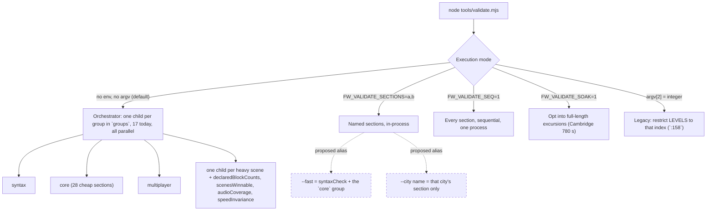

# Validator Modularization & Performance Optimization

> Living plan for the architecture, diagnostics, and optimization roadmap of Flywheel's validation suite (`tools/validate.mjs`). Line numbers cite the tree as of 2026-08-20; re-verify before acting on them.

---

## 1. Context & Motivation

`node tools/validate.mjs` is the central automated test suite and invariant gate for Flywheel. It is executed before commits, during feature development, and as a release gate.

As Flywheel expanded to 11+ voxel cities, camera-occlusion probes, the multiplayer suites, and full 60 Hz physics excursions, the full suite runtime grew to **20–30+ wall-clock minutes**.

For targeted edits (UI styling, audio cues, save schema, a single city's geometry) a 30-minute gate blocks iteration.

This plan provides **seconds-scale fast iteration modes** while preserving the full release gate unchanged.

---

## 2. Root-Cause Performance Diagnostics

Ordered by how much of the 30 minutes each one actually accounts for.

### A. Long excursions in the big cities (the ~30 minutes)
- **Mechanism**: Cambridge (72k+ blocks), Chicago, and Tokyo simulate multi-minute route tours at 60 Hz. `speedInvariance` is two further full Chicago excursions in its own child.
- **Measured** (comments at `tools/validate.mjs:1446-1491`): Cambridge's opening 240 sim-seconds cost ~19 wall-seconds; the remaining 540 s cost ~29 wall-**minutes**; one run of that section was observed at 30+ CPU-minutes and still going. Chicago is the orchestrator's wall-clock long pole.
- **Cause on record**: debris churn grows superlinearly as collapses pile up. Documented in `RCA-2026-08-11` (see `.wiki/adr/0018-debris-retires-on-proven-stationarity.md`). The exponent has not been fitted; treat "superlinear" as the claim, not `O(N^2)`.
- **Design note**: Cambridge was specified to *look* as detailed as 73k voxels, not to *be* 73k. That is the upstream reason this section is expensive.

### B. Unconditional scene preloading in every child
- **Mechanism** (`tools/validate.mjs:91-93`):
  ```js
  if (process.env.FW_VALIDATE_SECTIONS || process.env.FW_VALIDATE_SEQ) {
    await Promise.all(['sydney', 'auckland', 'singapore', 'manhattan', 'upper-manhattan', 'brooklyn', 'boston', 'cambridge', 'chicago', 'tokyo'].map(loadScene));
  }
  ```
- **Bottleneck**: the orchestrator spawns one child per group (currently 17 groups, `:3099-3133`), every child sets `FW_VALIDATE_SECTIONS`, so every child loads all ten scenes, including `syntax`, `core`, and `multiplayer`, which never construct a sim. Cost is seconds per child, not minutes.

### C. Sequential subprocess spawning in loops
- **Mechanism**: `syntaxCheck` runs `spawnSync(process.execPath, ['--check', f])` sequentially (`:2899`) across the 79 files under `js/` (~11 s wall). `multiplayer` runs its 21 standalone suites the same way.
- **Bottleneck**: Windows process start/teardown is ~100–150 ms each. Seconds, not minutes.

### D. Monolithic harness
- `tools/validate.mjs` is 3,474 lines holding probes, excursions, math guards, migrations, audio checks, and the orchestrator. This is a maintainability cost, not a runtime cost.

---

## 3. Target Architecture & Optimization Strategy

Work order follows §2: the excursion budget first, because it is the only item that moves the 30-minute number.



Solid edges are what the codebase does today; dashed edges are proposed. `tools/lib/` and `tools/suites/` do not exist yet and are deliberately absent from the diagram until §3.4 lands.

### 3.1 Budget the heavy excursions by work, not by sim-seconds
- Replace the fixed `DURATION` in the Cambridge/Chicago/Tokyo excursions with a budget in laps or eaten-blocks that still proves determinism and the floors (`eatenCount >= 1000`, the blockers count), as the code comment at `:1479-1491` already proposes.
- Keep `FW_VALIDATE_SOAK=1` as the path to the full route.
- **Test first**: record the current per-section wall time as the baseline (round-robin, min-of-N, not a single timing on a busy box), then assert the budgeted gate still fails on the commit each floor was written to catch.

### 3.2 Per-child scene preloading
- Preload only what the child's sections need: `syntaxCheck`, `core`, `multiplayer` load nothing; a city child loads its own scene; `declaredBlockCounts` and `scenesWinnable` load all playable scenes.
- Derive the need from the section list rather than a second hand-maintained table, or the table becomes another "registered but never listed" drift point.

### 3.3 Concurrent syntax validation
- Run the `--check` spawns concurrently, or compile in-process with `vm` / `new Function` on the module source. Target: ~11 s to < 1 s.

### 3.4 Tiered CLI aliases
- `--fast`: alias for `FW_VALIDATE_SECTIONS=syntaxCheck,<the core group>`. Nothing new runs; it is a name for a subset that already exists (`:3110`).
- `--city <name>` (the single spelling; the diagram and the text agree on it): alias for `FW_VALIDATE_SECTIONS=<name>`. Honest cost: Sydney/Auckland/Singapore are seconds; Cambridge's gate is ~19 s *after* §3.1; Chicago is whatever §3.1 leaves it. "< 5 s for any city" is not a target.
- `process.argv[2]` is currently parsed as an integer level index (`:158`). Any flag parsing must leave that path intact or retire it explicitly in the same change.
- Full release gate: `node tools/validate.mjs` unchanged.

### 3.5 Modular reorganization (last, and only with the re-prove step)
- Extract the shared probes (`probeCellOwnership`, `probeCameraBlockers`, `probeBoundsRect`, `probeRoadConflicts`, `probeRimmedWater`, `probeBareGround`, `probeOpenGround`, …, `:438-601`) into `tools/lib/scene-probes.mjs`; move section groups into `tools/suites/*.mjs`.
- `tools/orchestrator-coverage.test.mjs` scans the validator *source text* for `section('name')` registrations and the literal `const groups = [` array (`:33-44`). Moving sections out of `validate.mjs` breaks that scan; teach it to follow imports **before** the move, or the coverage guard goes green on an empty set.

---

## 4. Invariants & Guardrails

1. **Strict TDD**: every step lands with its failing test first; `orchestratorCoverage` keeps enforcing bidirectional section ↔ group coverage.
2. **Pure sim boundary**: no DOM or three.js imports in anything the Node validator loads.
3. **No modification of peer-agent files**: in-progress work such as `js/voxelscene-hongkong.js` and `tools/validate-hongkong.mjs` is off limits.
4. **Empty scope refuses.** Any mode or alias (`--fast`, `--city`, `FW_VALIDATE_SECTIONS`) that resolves to zero sections, or that spawns zero children, exits non-zero with the names it could not resolve. "PASS, 0 gates ran" has shipped green before; a count of zero is a reading, not a pass.
5. **A refactored guard is re-proved against the bad commit.** Every probe moved in §3.5, and every excursion re-budgeted in §3.1, is re-run against the commit it was written to catch and must still fail there. Green on HEAD after a refactor proves nothing; the last probe consolidation left both scenes green and dropped a defect class.
6. **No full-suite run as a gate for this work.** Validate §3.1–3.5 with `FW_VALIDATE_SECTIONS=<the sections touched>` plus the baseline timing; a 30-minute run is the thing being fixed, not the tool for fixing it.
7. **Targets are measured, never asserted.** Any number in this plan (19 s, 11 s, 29 min) is replaced by a fresh measurement before it is used as a pass/fail threshold.
